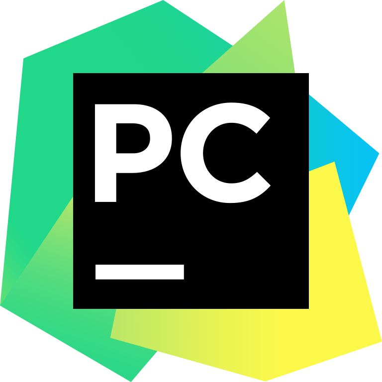

### Hey I am [Zeenat Parveen](https://github.com/zeenatparveen) ###
I'm a passionate and energetic college student pursuing my B.Tech(2017-2021)in Computer Science and Engineering at Raghu Institute Of Technology🚀 from India.Passionate about implementing new projects ,using my knowledge that I have acquired from my coursework as well as self study and with my hard work that can solve real world problems.Looking to start the career as an entry-level software engineer with a reputed firm driven by technology.

Beside's developing stuff, I enjoy listening music 🎧 and Drawing🎨🖌️

:e-mail: How to reach me:
* [zeenatparveen45@gmail.com](zeenatparveen45@gmail.com)
* [Linkedin](https://www.linkedin.com/in/zeenat-parveen/)
### Languages and Tools that I usually work with: ###

  
  
  

 

